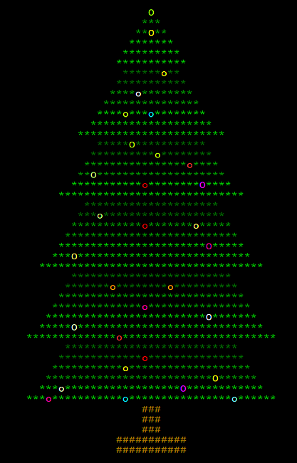

# Python Christmas Challenge 2020

  

The Python Christmas Challenge is made up of a set of puzzles that you have to solve. The puzzles get harder and harder. You don't *have* to use Python to solve all of them, but you will find it a lot less tedious if you do.

When you have solved a puzzle you get to the next level by adding your answer into the web page address, as shown in your web browser's address bar. The webpage for the first puzzle shows exactly how to do this.

At the beginning the puzzles have a one or two hints to point you in the right direction, but as the puzzles get harder the hints are fewer and fewer. You might even find you need to do some research on the internet to find out how to write some bits of Python code for the more difficult levels.

We will share everybody's progress at the Code Club Python session on Saturday 19th December 2020 and make awards for the coders who have been the most successful or creative. You will be able to tell us how far you got, and show us the coding you have done.

You can write your Python code in trinket or using any other Python editor, but please make sure you save the code you write to solve any of the puzzles: that way you can share it with us on 19th December.

Are you waiting to get started? Here is the link to the challenge:

[http://18.188.134.147/xmas_challenge_2020/](http://18.188.134.147/xmas_challenge_2020/)
